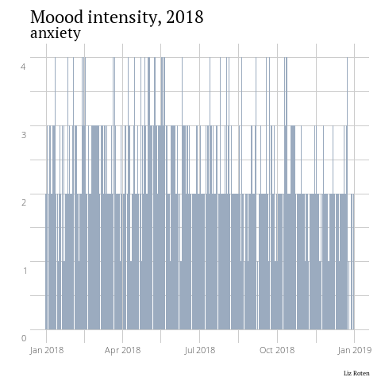
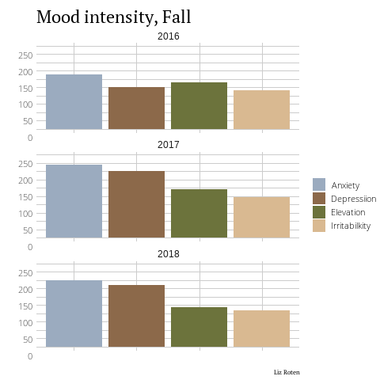

```{r setup, include=FALSE, message=FALSE, warning = FALSE}
knitr::opts_chunk$set(dev = "CairoPNG", dpi = 300,
                      gganimate.dev_args = list(res=96))
```

Things I love include data visualization, tutorials, and fighting mental illness stigma. This post combines them all! I made a pretty neat [layout](https://lizroten.info/portfolio/3-years-of-mental-health-a-quantified-self-story/) with plots and a map of my Location History a while back, and here I'll walk through some of the data cleaning process and custom styling.   

## Export and download app data  

I use [eMoods](https://emoodtracker.com/) to track my mental health from day to day.  I'm a superfan of this app. Its neat to see my own mood data, but the "Email Report" function lets me keep my care team update on the day to day. All the data you put in is stored locally on your device, so privacy concerns are minimized. Check out this [page](https://emoodtracker.com/blog/analyzing-emoods-data-in-spreadsheet-form) for details about how to export and download. I exported my files to Google Drive and downloaded from there.  

I name nearly all the data I download with the date in ISO 8601 format, especially if there may be future downloads. I got this practice from Jenny Byran's *[What They Forgot to Teach You About R](https://whattheyforgot.org/)* and have never looked back.  

We will use `unzip()` from the utils package and view what all we exported. 

```{r eval=FALSE}
unzip(
  zipfile = "20190831_eMoods.zip",
  exdir = "20190831_eMoods"
)

list.files("20190831_eMoods/")
```
```{r, echo = FALSE}
# saveRDS(orig_file_list, "orig_file_list.RDS")
readRDS(file = "orig_file_list.RDS")
```

Because this is my personal day-to-day log, I deleted the original .zip, most of the files downloaded, and removed columns with detailed notes using Excel. I re-saved the edited "entry.csv" as (you guessed it) "entry_edit.csv".  

## Clean and tidy  

To start, I load a few of my favorite data cleaning packages into my environment.  

```{r, warning = FALSE, message = FALSE}
library(data.table)
library(dplyr)
library(janitor)
library(lubridate)
library(tidyr)
```

Next, I read in "entry_edit.csv" and perform some basic cleaning before taking a peak at the table using `head()`.  

```{r}
entry <- fread("entry_edit.csv") %>%
  clean_names() %>%
  mutate(
    date = as_date(date_yyyy_mm_dd),
    year = year(date)
  )

head(entry)
```

The numbers for each mood represent the intensity of that mood on the given date, sleep indicates the number of hours I slept the previous night, and therapy indicates whether or not I had talk therapy that day (1 = no, 2 = yes). 0 indicates that I didn't record anything for that day. This usually means that I pulled an all-nighter, or was on a retreat without my phone. The mood classifications are below:

|Intensity|Interpretation|  
| -------------- | -------------- | 
|0               | Not recorded |  
|1               | None |  
|2               | Mild - Without significant impairment |   
|3               | Moderate - Significant impairment, able to work |   
|4               | Severe - Significant impairment, not able to work |  


We can view a data summary using `summary()`.  

```{r}
summary(entry)
```


## Visualize moods over time with ggplot2  

First, lets load  go for a simple bar plot.  

```{r, message=FALSE}
library(ggplot2)

ggplot(data = entry) +
  geom_col(
    mapping = aes(x = date, y = depressed))
```

We can see some peaks here and there. This plot isn't super attractive. Now we can start getting into the fun (or tedious, depending on who you ask) stuff.    

Here, I filter the data to only include 2018, add monthly scale labels, and change the coordinate system from cartesian to polar. This produces a radial bar graph, also known as a star plot, polar coordinate plot, or whatever else. I used `labs()` to add a title and changed the fill and color to #426486 (a lovely dark blue).   

```{r}
ggplot(data = filter(entry, year == 2018)) + # filter to only include 2018
  geom_col(
    mapping = aes(x = date, y = depressed),
    color = "#426486",
    fill = "#426486"
  ) +
  scale_x_date(
    date_breaks = "1 months", date_labels = "%b", # add labels by month
    date_minor_breaks = "1 month"
  ) +
  coord_polar() +
  labs(title = "Depression, 2018")
```

ggplot2 comes with several [themes](https://ggplot2.tidyverse.org/reference/ggtheme.html) out of the box, and others in the [ggthemes package](https://jrnold.github.io/ggthemes/). You can browse styles [here](https://yutannihilation.github.io/allYourFigureAreBelongToUs/ggthemes/).

## Custom styles  

Before making more plots, I reshaped the data to make for easy faceting in ggplot2.  

```{r, dev="CairoPNG"}
plot_data_2018 <- entry %>%
  filter(year == "2018") %>%
  group_by(date) %>%
  gather("depressed", "anxiety",
         "elevated", "irritability",
         key = "mood", value = "intensity"
  ) %>%
  select(date, mood, intensity)

plot_data <- entry %>%
  group_by(date) %>%
  gather("depressed", "anxiety",
         "elevated", "irritability",
         key = "mood", value = "intensity"
  ) %>%
  select(date, mood, intensity) %>%
  filter(mood %in% c("depressed", "anxiety"))
```

Using a ggplot2 theme is a great place to start if you want to do any additional formating. You can save all your carefully crafted styles as a function, and then apply it to your plot as you would any other theme.

Here, I import [showtext](https://github.com/yixuan/showtext) and add in fonts I already have installed on my machine. All of them can be downloaded from [Google Fonts](https://fonts.google.com/).  

```{r, message=FALSE, warning = FALSE}
library(showtext)
showtext_auto()

font_add("Lato", "Lato-Regular.ttf")
font_add("Open Sans Light", "OpenSans-Light.ttf")
font_add("PT Sans", "PTSans-Regular.ttf")
font_add("PT Serif", "PTSerif-Regular.ttf")
```

Here, I write my `my_theme()`. The other benefit to using a theme object/function is that any changes you make to the object will be applied to whatever plot you use it with.  

```{r,dev="CairoPNG"}
## font sizes --------------------------------------------
size_header <- 14
size_axis_title <- 12
size_legend_title <- 12
size_axis_text <- 8
size_legend_text <- 8
size_caption <- 6

## color -------------------------------------------------
background_color <- "white"

my_colors <- c(
  "#9BABBF",
  "#8C694A",
  "#6C733C",
  "#D9B991"
)
## theme function -----------------------------------------
my_theme <- function(...) {
  theme_minimal() +
    theme(
      ### plot and panel-----------------------------------
      plot.background = element_rect(
        fill = background_color,
        linetype = 0,
        colour = NA
      ),
      panel.background = element_rect(
        fill = background_color,
        linetype = 0,
        color = NA
      ),
      panel.grid = element_line(colour = "#cccccc"),
      plot.margin = unit(c(.5, .5, .2, .5), "cm"),
      panel.border = element_blank(),
      ### title and caption -------------------------------
      title = element_text(family = "PT Serif",
                           size = size_header),
      plot.caption = element_text(size = size_caption),
      ### axis and strip text ------------------------------
      # strip.text = element_blank(),
      axis.title = element_text(size = size_axis_title),
      axis.text = element_text(
        family = "Open Sans Light",
        size = size_axis_text,
        vjust = 2
      ),
      ## legend text ----------------------------------------
      legend.position = "bottom",
      legend.text = element_text(
        family = "Open Sans Light",
        size = size_legend_text
      )
    )
}
```

This plot facets by mood, and only includes anxiety and depression.  

```{r}
ggplot(data = plot_data) +
  geom_col(
    mapping = aes(
      x = date,
      y = intensity,
      fill = mood
    ),
    color = NA
  ) +
  facet_wrap("mood",
             nrow = 2,
             ncol = 1
  ) +
  scale_fill_manual(
    values = my_colors,
    aesthetics = c("fill"),
    labels = c(
      "Anxiety",
      "Depression"
    )
  ) +
  labs(
    x = "",
    y = "",
    title = "Mood intensity, 2015 - 2019",
    fill = "",
    caption = "Liz Roten"
  ) +
  my_theme()
```

Here, I filtered the data to only include depression and kept the month labels. This provides context for the next plot, which facets on mood.  

```{r, dev="CairoPNG"}
ggplot(data = filter(
  plot_data_2018,
  mood == "depressed"
)) +
  geom_col(
    mapping = aes(
      x = date,
      y = intensity,
    ),
    fill = my_colors[2],
    color = my_colors[2]
  ) +
  scale_x_date(
    date_breaks = "1 months",
    date_labels = "%b",
    date_minor_breaks = "1 month"
  ) +
  scale_y_discrete(labels = NULL) +
  labs(
    x = "",
    y = "",
    title = "Depression, 2018",
    fill = "",
    caption = "Liz Roten"
  ) +
  coord_polar() +
  my_theme()

```

```{r, eval = FALSE, include=FALSE}
ggsave(filename = "depression_2018.png", dpi = "print", type = "cairo")
```

```{r, dev="CairoPNG",collapse=TRUE}
ggplot(data = plot_data_2018) +
  geom_col(
    mapping = aes(
      x = date,
      y = intensity,
      fill = mood
    ),
    color = NA
  ) +
  facet_wrap("mood",
             nrow = 2,
             ncol = 2
  ) +
  scale_x_date(
    date_breaks = "1 months",
    labels = NULL,
    date_minor_breaks = "1 month"
  ) +
  scale_y_discrete(labels = NULL) +
  scale_fill_manual(
    values = my_colors,
    aesthetics = c("fill"),
    labels = c(
      "Anxiety",
      "Depression",
      "Elevation",
      "Irritability"
    )
  ) +
  labs(
    x = "",
    y = "",
    title = "2018 in Moods",
    fill = "",
    caption = "Liz Roten"
  ) +
  coord_polar() +
  my_theme()
```

```{r, eval = FALSE, include = FALSE}
ggsave(filename = "all_2018.png", dpi = 100, type = "cairo")
```

There is much more I want to do with this data, like examining different seasons, how sleep and therpay influence depression and anxiety, and how medication adjustments played out.  

## October 2019 update: now with gganimate!  

I've made a series of iterative plots for work, and I finally decided to try [gganimate](https://gganimate.com/). Friends, I may never go back.  

```{r}
library(gganimate)
```

```{r,eval=FALSE}
ggplot(data = plot_data %>% 
         filter(year(date) == 2018)) +
  geom_col(
    mapping = aes(
      x = date,
      y = intensity,
      fill = mood,
      group = 1L),
    color = NA
  ) +
  scale_fill_manual(
    values = my_colors,
    aesthetics = c("fill"),
    labels = c(
      "Anxiety",
      "Depression"
    )
  ) +
  labs(
    x = "",
    y = "",
    fill = "",
    caption = "Liz Roten"
  ) +
  my_theme() +
  theme(
    legend.position = "none"
  ) + 
  transition_states(mood,
                    transition_length = 2,
                    state_length = 1) +
  ggtitle("Mood intensity, 2018",
          subtitle = '{closest_state}')
```
```{r, eval = FALSE, include = FALSE}
anim_save("2018_moods.gif")
```

<center>  
  
</center>    
   
  
Lets take a look at seaons. Lets find the total intensity grouped by year, season, and mood.  

```{r}
plot_seasons <- entry %>% 
  group_by(date) %>%
  gather("depressed", "anxiety",
         "elevated", "irritability",
         key = "mood", value = "intensity"
  ) %>%
  select(date, mood, intensity) %>% 
  mutate(year = year(date)) %>% 
  mutate(season = case_when(month(date) %in% c("12", "1", "2") ~ "Winter",
                            month(date) %in% c("3", "4", "5") ~ "Spring",
                            month(date) %in% c("6", "7", "8") ~ "Summer",
                            month(date) %in% c("9", "10", "11") ~ "Fall"),
         season = factor(season, levels = c("Winter",
                                            "Spring",
                                            "Summer",
                                            "Fall"))) %>% 
  group_by(year, season, mood) %>% 
  mutate(total_mood = sum(intensity)) %>% 
  select(-date, -intensity) %>% 
  unique()
```


```{r,eval=FALSE, ani.res = 300}
ggplot(data = plot_seasons %>% 
         filter(!year %in% c(2015, 2019))) +
  geom_col(
    mapping = aes(
      x = mood,
      y = total_mood,
      fill = mood,
      group = 1L),
    color = NA
  ) +
  scale_fill_manual(
    values = my_colors, 
    labels = c("Anxiety",
               "Depression",
               "Elevation",
               "Irritability")
  ) +
  facet_wrap(~year,
             nrow = 3,strip.position = "top") +
  labs(
    x = "",
    y = "",
    fill = "",
    caption = "Liz Roten"
  ) +
  my_theme() +
  theme(
    legend.position = "right",
    axis.text.x = element_blank(),
  ) + 
  transition_states(season,
                    transition_length = 2,
                    state_length = 3) +
  ggtitle("Mood intensity, {closest_state}")
```
```{r, eval = FALSE, include = FALSE}
gganimate::anim_save(file = "moods_by_season_year.gif")
```

<center>  
  
</center>    

## Inspiration and credits  

* This [amazing bivariate choropleth map](https://timogrossenbacher.ch/2019/04/bivariate-maps-with-ggplot2-and-sf/) by [Tim Grossenbacher](https://timogrossenbacher.ch/).  
* `my_colors` came from [this photo](https://photos.app.goo.gl/bBVEREQ1NMvJSPgi7) I took last December while visiting my partner's family in Çeşme, Turkey.   
